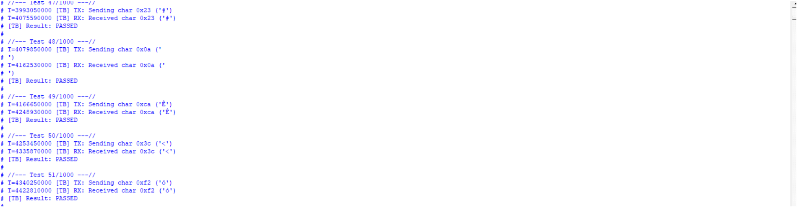

# APB-UART Peripheral Specification

## 1. Giới thiệu
Dự án **APB-UART** cung cấp một module UART tích hợp giao diện AMBA-APB, cho phép CPU hoặc bus master dễ dàng điều khiển truyền nhận UART qua register read/write. Thiết kế hỗ trợ:

apb_uart là một bộ điều khiển UART APB đơn giản, thực hiện hai nhiệm vụ chính:

- Chuyển đổi dữ liệu tuần tự nhận từ thiết bị ngoại vi thành dữ liệu song song gửi đến bộ xử lý (CPU).

- Chuyển đổi dữ liệu song song nhận từ bộ xử lý thành dữ liệu tuần tự gửi đến thiết bị ngoại vi.
Bộ xử lý có thể đọc trạng thái hoạt động của UART bất cứ lúc nào.
- Cấu hình số data bits (5–8), stop bits (1–2), parity (even/odd hoặc tắt).
- Hardware flow-control (RTS/CTS).
- Baud‐rate generator có thể điều chỉnh theo tần số hệ thống và tốc độ baud mong muốn.
- Hỗ trợ các giá trị tốc độ baud: 2400, 4800, 9600, 19200, 38400, 57600, 76800, 115200 và 230400 (có thể cấu hình qua tham số).
Ngoài ra, thiết kế này còn hỗ trợ 1 số tính năng phụ để có thể áp dụng trong thực tế: 
- Truyền đủ số byte được truyền vào thay vì 1 byte duy nhất
- Tự động ngắt báo và báo lỗi (sau khoảng thời gian có thể config được) nếu như nhận quá lâu 

## 2. Sơ đồ hệ thống

**Các khối con**: 
## Chú thích chân và giải thích chức năng các khối

### 1. apb_uart_top

| Tên cổng       | Hướng  | Độ rộng | Mô tả                                                                                                            |
|----------------|--------|---------|------------------------------------------------------------------------------------------------------------------|
| **clk**        | input  | 1 bit   | Clock hệ thống, dùng cho UART TX/RX, RTS/CTS, Baud Generator.                                                   |
| **rst_n**      | input  | 1 bit   | Reset tổng (active low) cho toàn bộ khối.                                                                         |
| **pclk**       | input  | 1 bit   | Clock cho giao diện APB (APB clock).                                                                             |
| **presetn**    | input  | 1 bit   | Reset cho giao diện APB (active low).                                                                             |
| **psel**       | input  | 1 bit   | APB slave select: 1 nghĩa là CPU đang chọn module này.                                                             |
| **penable**    | input  | 1 bit   | APB enable: 1 trong pha TRANSFER, dùng để thực hiện read/write.                                                   |
| **pwrite**     | input  | 1 bit   | APB write/read indicator: 1 = write, 0 = read.                                                                    |
| **paddr[12:0]**| input  | 13 bit  | APB address bus. Địa chỉ các thanh ghi: TX_DATA (0x000), RX_DATA (0x004), CFG (0x008), CTRL (0x00C), STT (0x010). |
| **pwdata[31:0]** | input| 32 bit  | APB write-data bus. CPU ghi dữ liệu 8-bit vào TX_DATA, CFG, CTRL qua bus này.                                      |
| **pstrb[3:0]** | input  | 4 bit   | Byte-strobe (không dùng đặc biệt, thường để chọn byte hợp lệ).                                                    |
| **prdata[31:0]** | output| 32 bit  | APB read-data bus. Khi CPU đọc, module trả dữ liệu từ các thanh ghi RX_DATA, CFG, CTRL, STT.                       |
| **pslverr**    | output | 1 bit   | APB slave error: 1 nếu truy cập địa chỉ invalid hoặc timeout. Trong thiết kế này, thường giữ 0 (không lỗi).        |
| **pready**     | output | 1 bit   | APB ready: 1 khi slave sẵn sàng hoàn thành transfer. Đây luôn high để không chèn wait-state.                      |
| **rx**         | input  | 1 bit   | UART RX input: dữ liệu serial nhận từ thiết bị ngoại vi.                                                          |
| **cts_n**      | input  | 1 bit   | Clear To Send (active-low) từ ngoại vi: 0 = được phép gửi, 1 = không được phép.                                   |
| **tx**         | output | 1 bit   | UART TX output: dữ liệu serial truyền ra thiết bị ngoại vi.                                                        |
| **rts_n**      | output | 1 bit   | Request To Send (active-low) xuất ra: 0 = module muốn gửi, 1 = module đang idle.                                   |

#### Chức năng tổng quan
1. Nhận lệnh đọc/ghi từ APB (apb_interface).  
2. Cấu hình, lưu và trả giá trị các thanh ghi qua register_block.  
3. Điều khiển luồng dữ liệu UART qua UART TX, UART RX, RTS/CTS logic và Baud Rate Generator.

---

### 2. apb_interface

| Tên cổng               | Hướng  | Độ rộng | Mô tả                                                                                                    |
|------------------------|--------|---------|----------------------------------------------------------------------------------------------------------|
| **pclk**               | input  | 1 bit   | APB clock.                                                                                               |
| **presetn**            | input  | 1 bit   | APB reset (active low).                                                                                   |
| **psel**               | input  | 1 bit   | APB select: 1 khi CPU chọn module này.                                                                    |
| **penable**            | input  | 1 bit   | APB enable: 1 trong pha TRANSFER.                                                                         |
| **pwrite**             | input  | 1 bit   | 1 = write, 0 = read.                                                                                      |
| **paddr[12:0]**        | input  | 13 bit  | APB address bus (đã chuyển thành reg_address_des[4:0] để cấp cho register_block).                        |
| **pwdata[31:0]**       | input  | 32 bit  | Dữ liệu CPU viết.                                                                                         |
| **pstrb[3:0]**         | input  | 4 bit   | Byte-strobe của APB.                                                                                      |
| **pready**             | output | 1 bit   | APB ready: luôn high trong ACCESS phase (không chèn wait-state).                                          |
| **prdata[31:0]**       | output | 32 bit  | APB read-data bus: dữ liệu lấy từ register_block (data_read) khi CPU đọc.                                |
| **pslverr**            | output | 1 bit   | APB slave error: 1 nếu address invalid hoặc timeout.                                                      |
| **reg_address_des[4:0]** | output| 5 bit   | Địa chỉ 5 bit sau khi decode:  
| **data_write_to_reg[7:0]** | output | 8 bit | Dữ liệu 8-bit cần ghi vào register_block (lấy từ pwdata & pstrb).                                        |
| **start_tx_signal**    | output | 1 bit   | Pulse báo register_block bật bit START_TX trong thanh ghi CTRL.                                          |
| **data_read[7:0]**     | input  | 8 bit   | Dữ liệu 8-bit trả về từ register_block khi CPU đọc (RX_DATA/CFG/CTRL/STT).                               |
| **tx_done_signal**     | input  | 1 bit   | Báo register_block cờ TX_DONE (dẫn về STT).                                                               |
| **rx_done_signal**     | input  | 1 bit   | Báo register_block cờ RX_DONE (dẫn về STT).                                                               |
| **parity_error_signal** | input | 1 bit   | Báo register_block cờ PARITY_ERROR (dẫn về STT).                                                          |
        0x00=TX_DATA, 0x04=RX_DATA, 0x08=CFG, 0x0C=CTRL, 0x10=STT. 
#### Chức năng tổng quan
- Thực thi state machine APB (SETUP vs TRANSFER).  
- Decode địa chỉ APB, drive `reg_address_des` và `data_write_to_reg` khi write, hoặc lấy `data_read` để trả `prdata` khi read.  
- `pready=1` ngay lập tức trong ACCESS, `pslverr`=1 nếu address invalid hoặc timeout khi đọc RX.

---

### 3. register_block

| Tên cổng                   | Hướng  | Độ rộng | Mô tả                                                                                                       |
|----------------------------|--------|---------|-------------------------------------------------------------------------------------------------------------|
| **pclk**                   | input  | 1 bit   | APB clock.                                                                                                  |
| **presetn**                | input  | 1 bit   | Reset thanh ghi (active low).                                                                                |
| **psel**                   | input  | 1 bit   | APB select.                                                                                                 |
| **penable**                | input  | 1 bit   | APB enable.                                                                                                  |
| **pwrite**                 | input  | 1 bit   | APB write/read.                                                                                             |
| **pslverr**                | input  | 1 bit   | APB slave error (dùng để giữ giá trị khi lỗi).                                                               |
| **reg_address_des[4:0]**   | input  | 5 bit   | Địa chỉ 5 bit sau decode: 0x00=TX_DATA, 0x01=RX_DATA, 0x02=CFG, 0x03=CTRL, 0x04=STT.                          |
| **data_write_to_reg[7:0]** | input  | 8 bit   | Dữ liệu 8-bit ghi vào thanh ghi tương ứng.                                                                     |
| **start_tx_signal**        | input  | 1 bit   | Pulse từ apb_interface báo “bật” bit START_TX trong thanh ghi CTRL.                                         |
| **data_to_APB[7:0]**       | output | 8 bit   | Dữ liệu 8-bit trả về APB (từ RX_DATA, CFG, CTRL, STT khi CPU đọc).                                           |
| **tx_done_signal**         | output | 1 bit   | Cờ TX_DONE (ghi vào STT bit[0]).                                                                             |
| **rx_done_signal**         | output | 1 bit   | Cờ RX_DONE (ghi vào STT bit[1]).                                                                             |
| **parity_error_signal**    | output | 1 bit   | Cờ PARITY_ERROR (ghi vào STT bit[2]).                                                                         |
| **set_tx_done**            | input  | 1 bit   | Tín hiệu từ UART_TX: pulse khi UART TX hoàn thành.                                                           |
| **set_rx_done**            | input  | 1 bit   | Tín hiệu từ UART_RX: pulse khi UART RX hoàn thành.                                                           |
| **set_parity_error**       | input  | 1 bit   | Tín hiệu từ UART_RX: báo lỗi parity.                                                                         |
| **rx_data_in[7:0]**        | input  | 8 bit   | Dữ liệu 8-bit thu được từ UART_RX.                                                                            |
| **tx_data_out[7:0]**       | output | 8 bit   | Dữ liệu 8-bit đưa xuống UART_TX (lấy từ tx_data_reg).                                                          |
| **start_tx**               | output | 1 bit   | Cờ `ctrl_reg[0]` đưa xuống UART_TX để bắt đầu truyền.                                                         |
| **cfg_reg_out[4:0]**       | output | 5 bit   | Cấu hình UART (data_bits, parity, stop_bits) đưa xuống UART_TX và UART_RX.                                     |

#### Chức năng tổng quan
- Quản lý các thanh ghi:  
  - **tx_data_reg[7:0]** ← data_write_to_reg khi ghi vào TX_DATA (0x000).  
  - **rx_data_reg[7:0]** ← rx_data_in khi UART RX nhận xong.  
  - **cfg_reg[4:0]** ← data_write_to_reg khi ghi vào CFG (0x008).  
  - **ctrl_reg[0]** ← start_tx_signal khi ghi vào CTRL (0x00C).  
  - **stt_reg[2:0]** ← {set_parity_error, set_rx_done, set_tx_done}.  
- Xuất ra:  
  - `tx_data_out = tx_data_reg[7:0]`  
  - `start_tx = ctrl_reg[0]`  
  - `cfg_reg_out = cfg_reg[4:0]`  
  - `tx_done_signal = stt_reg[0]`  
  - `rx_done_signal = stt_reg[1]`  
  - `parity_error_signal = stt_reg[2]`  
  - `data_to_APB` trả giá trị theo địa chỉ read (RX_DATA, CFG, CTRL, STT).

---

### 4. rts_cts_logic

| Tên cổng     | Hướng  | Độ rộng | Mô tả                                                                                                                   |
|--------------|--------|---------|-------------------------------------------------------------------------------------------------------------------------|
| **clk**      | input  | 1 bit   | Clock hệ thống (đồng bộ tín hiệu RTS).                                                                                    |
| **reset_n**  | input  | 1 bit   | Reset logic (active low).                                                                                                 |
| **start_tx** | input  | 1 bit   | Tín hiệu khởi động truyền từ register_block (pulse).                                                                      |
| **tx_busy**  | input  | 1 bit   | Tín hiệu báo UART_TX đang bận (1 = đang truyền).                                                                           |
| **cts**      | input  | 1 bit   | Clear To Send từ ngoại vi (active low: 0 = được phép, 1 = không cho phép).                                                |
| **rts**      | output | 1 bit   | Request To Send (active low): 0 = module muốn gửi hoặc đang bận, 1 = idle.                                                 |
| **tx_enable**| output | 1 bit   | Tín hiệu kích hoạt cho UART_TX: `start_tx & ~tx_busy & ~cts`. Chỉ cho phép khi cả ba điều kiện đúng.                        |

#### Chức năng tổng quan
- `tx_enable = start_tx & ~tx_busy & ~cts`.  
- `rts` được assert (0) khi muốn gửi hoặc đang bận (`start_tx=1` hoặc `tx_busy=1`), de-assert (1) khi idle.

---

### 5. uart_baud_rate_generator

| Tên cổng       | Hướng  | Độ rộng | Mô tả                                                                                                      |
|----------------|--------|---------|------------------------------------------------------------------------------------------------------------|
| **clk**        | input  | 1 bit   | System clock (ví dụ 50 MHz).                                                                                |
| **rst_n**      | input  | 1 bit   | Reset (active low).                                                                                         |
| **baud_tick**  | output | 1 bit   | Xung tốc độ baud: phát ra 1 khi counter đạt DIVISOR = `CLK_FREQ_HZ/BAUD_RATE`.                               |

#### Chức năng tổng quan
- Tính `DIVISOR = CLK_FREQ_HZ / BAUD_RATE`.  
- Mỗi `posedge clk`, tăng `counter`; khi `counter == DIVISOR-1`, reset `counter = 0` và `baud_tick = 1`. Ngược lại, `baud_tick = 0`.

---

### 6. uart_tx

| Tên cổng         | Hướng  | Độ rộng | Mô tả                                                                                                                      |
|------------------|--------|---------|----------------------------------------------------------------------------------------------------------------------------|
| **clk**          | input  | 1 bit   | System clock.                                                                                                               |
| **rst_n**        | input  | 1 bit   | Reset (active low).                                                                                                         |
| **baud_tick**    | input  | 1 bit   | Xung tốc độ baud (từ Baud Rate Generator).                                                                                    |
| **tx_enable**    | input  | 1 bit   | Cho phép bắt đầu truyền (từ RTS/CTS logic).                                                                                  |
| **cfg_reg[4:0]** | input  | 5 bit   | Cấu hình UART:  
| **tx_data[7:0]** | input  | 8 bit   | Dữ liệu 8-bit cần truyền (lấy từ `tx_data_out` của register_block).                                                          |
| **tx**           | output | 1 bit   | Tín hiệu serial truyền ra.                                                                                                   |
| **tx_busy**      | output | 1 bit   | Báo UART TX đang bận (1 = truyền đang diễn ra).                                                                                |
| **tx_done**      | output | 1 bit   | Pulse báo đã hoàn thành truyền xong 1 byte.                                                                                   |

**Cấu hình UART**
- [1:0] data_bits (00=5, 01=6, 10=7, 11=8)  
- [2] stop_bits (0=1, 1=2)  
- [3] parity_en (0=no, 1=yes)  
- [4] parity_type (0=even, 1=odd)  
#### Chức năng tổng quan
- Khi `tx_enable=1 & state==IDLE`, latch `tx_data_reg = tx_data` và `cfg_reg_reg = cfg_reg`, tính `parity_bit` nếu parity_en.  
- FSM tuần tự qua các trạng thái: **IDLE** → **START_BIT** (tx=0) → **DATA_BITS** (phát lần lượt data bits) → **PARITY_BIT** (nếu parity_en) → **STOP_BITS** (tx=1 trong 1–2 xung) → back **IDLE**.  
- Khi hoàn thành, `tx_done = 1` và `tx_busy = 0`.

---

### 7. uart_rx

| Tên cổng        | Hướng  | Độ rộng | Mô tả                                                                                                                       |
|-----------------|--------|---------|-----------------------------------------------------------------------------------------------------------------------------|
| **clk**         | input  | 1 bit   | System clock.                                                                                                                |
| **rst_n**       | input  | 1 bit   | Reset (active low).                                                                                                          |
| **baud_tick**   | input  | 1 bit   | Xung tốc độ baud (từ Baud Rate Generator).                                                                                   |
| **rx**          | input  | 1 bit   | Tín hiệu serial nhận vào từ ngoại vi.                                                                                         |
| **cfg_reg[4:0]**| input  | 5 bit   | Cấu hình UART (data_bits, parity, stop_bits).                                                                                 |
| **rx_data[7:0]**| output | 8 bit   | Dữ liệu 8-bit đã nhận (LSB-first).                                                                                             |
| **rx_done**     | output | 1 bit   | Pulse báo đã nhận xong 1 byte.                                                                                                |
| **parity_error**| output | 1 bit   | Báo lỗi parity trong lần nhận cuối cùng (1 = sai).                                                                             |

#### Chức năng tổng quan
- FSM gồm: **IDLE** (chờ rx=0 start bit) → **START_BIT** (kiểm tra khi `baud_tick`) → **DATA_BITS** (mỗi `baud_tick`, lưu bit vào `rx_shift`, XOR vào `parity_calc`) → **PARITY_BIT** (so sánh, set `parity_error` nếu sai) → **STOP_BITS** (xác nhận `rx=1` và set `rx_done`) → back **IDLE**.  
- Sau khi xong, `rx_data = rx_shift`, `rx_done = 1`, `parity_error` chỉ thị nếu lỗi.

---


## 3. Cấu trúc module và file
Dưới đây liệt kê các file RTL kèm theo cùng chức năng chính của từng file:

```
├── apb_uart_top.sv
├── apb_interface.sv
├── register_block.sv
├── rts_cts_logic.sv
├── uart_baud_rate_generator.sv
├── uart_tx.sv
├── uart_rx.sv
├── tb_apb_uart_tb.sv
├── tb_uart_baud_rate_generator.sv
└── README.md
```

- **apb_uart_top.sv**  
  Toplevel module. Kết nối tất cả khối con: APB Interface, Register Block, RTS/CTS logic, Baud Rate Generator, UART TX, UART RX. Expose chân vật lý `tx`, `rx`, `rts_n`, `cts_n` và tín hiệu APB (`pclk`, `presetn`, `psel`, `penable`, `pwrite`, `paddr`, `pwdata`, `pstrb`, `prdata`, `pslverr`, `pready`).

- **apb_interface.sv**  
  Thực thi state machine APB (SETUP vs TRANSFER). Giải mã giao tiếp read/write.

- **register_block.sv**  
  Chứa thanh ghi: TX_DATA, RX_DATA, CFG, CTRL, STT. Cập nhật trạng thái TX_DONE, RX_DONE, PARITY_ERR.

- **rts_cts_logic.sv**  
  Sinh tín hiệu `tx_enable` dựa trên `start_tx`, `tx_busy`, `cts_n`. Quản lý `rts_n`.

- **uart_baud_rate_generator.sv**  
  Tạo xung `baud_tick` = 1 mỗi DIVISOR = `CLK_FREQ_HZ/BAUD_RATE` chu kỳ clock.

- **uart_tx.sv**  
  FSM truyền 1 byte: START, DATA_BITS, PARITY_BIT, STOP_BITS. Xuất tín hiệu `tx`, `tx_busy`, `tx_done`.

- **uart_rx.sv**  
  FSM nhận 1 byte: IDLE, START_BIT, DATA_BITS, PARITY_BIT, STOP_BITS. Xuất `rx_data`, `rx_done`, `parity_error`.

- **tb_apb_uart_tb.sv**  
  Testbench mô phỏng toàn bộ APB-UART: write CFG, TX_DATA, CTRL, polling STT, loopback tùy chọn, rồi dừng.

- **tb_uart_baud_rate_generator.sv**  
  Testbench đo khoảng cách giữa các xung `baud_tick` (≈ DIVISOR cycles) và tự động dừng.

---

## 4. Bản đồ thanh ghi (Register Map)
** Bản đồ 5 thanh ghi và mô tả chi tiết **

| Tên Register   | Mô tả                       | Địa chỉ | Quyền | Trường         | Reset | Vị trí  | Mô tả trường                                                                                                                                                           |
|----------------|-----------------------------|---------|-------|----------------|-------|---------|------------------------------------------------------------------------------------------------------------------------------------------------------------------------|
| **tx_data_reg**| TX data register            | 0x00    | RW    | tx_data        | 0     | [7:0]   | Dữ liệu song song 8 bit từ CPU, chờ UART TX chuyển thành dữ liệu nối tiếp và gửi ra chân TX.                                                                           |
|                |                             |         |       | rfu            | 0     | [31:8]  | (Reserved for Future Use) – Dự phòng, không sử dụng hiện tại.                                                                                                          |
| **rx_data_reg**| RX data register            | 0x04    | RO    | rx_data        | 0     | [7:0]   | Dữ liệu song song 8 bit đã được UART RX chuyển từ serial và lưu trữ để CPU đọc.                                                                                       |
|                |                             |         |       | rfu            | 0     | [31:8]  | (Reserved for Future Use) – Dự phòng, không sử dụng hiện tại.                                                                                                          |
| **cfg_reg**    | UART frame configuration    | 0x08    | RW    | data_bit_num   | 0     | [1:0]   | Chọn số bit dữ liệu:  
|                | register                    |         |       | stop_bit_num   | 0     | [2]     | Chọn số bit dừng:  
|                |                             |         |       | parity_en      | 0     | [3]     | Bật/tắt parity:  
|                |                             |         |       | parity_type    | 0     | [4]     | Loại parity:  
|                |                             |         |       | rfu            | 0     | [31:5]  | (Reserved for Future Use) – Dự phòng, không sử dụng hiện tại.                                                                                                          |
| **ctrl_reg**   | Operation control register  | 0x0C    | RW    | start_tx       | 0     | [0]     | Khi CPU ghi `1` vào bit này, UART TX bắt đầu lấy dữ liệu từ `tx_data_reg` và truyền nối tiếp. Sau khi ghi xong, CPU nên ghi lại `0` để tạo thành một pulse ngắn.      |
|                |                             |         |       | rfu            | 0     | [31:1]  | (Reserved for Future Use) – Dự phòng, không sử dụng hiện tại.                                                                                                          |
| **stt_reg**    | Operation status register   | 0x10    | RO    | tx_done        | 1     | [0]     | Khi UART TX hoàn thành việc chuyển đổi song song → nối tiếp cho một byte, trường này được set = 1 để báo cho CPU biết.                                                 |
|                |                             |         |       | rx_done        | 0     | [1]     | Khi UART RX hoàn thành việc chuyển đổi nối tiếp → song song cho một byte và lưu vào `rx_data_reg`, trường này được set = 1 để báo cho CPU biết.                         |
|                |                             |         |       | parity_error   | 0     | [2]     | Nếu UART RX phát hiện lỗi parity trong lần nhận cuối cùng, trường này được set = 1 để báo lỗi.                                                                          |
|                |                             |         |       | rfu            | 0     | [31:3]  | (Reserved for Future Use) – Dự phòng, không sử dụng hiện tại.                                                                                                          |

---


### Chi tiết hoạt động từng thanh ghi

1. **tx_data_reg (0x00, RW)**  
   - **Mục đích:** Chứa dữ liệu 8 bit do CPU (host) cung cấp, chờ UART TX lấy và gửi dưới dạng serial (nối tiếp).  
   - **Quy trình sử dụng:**  
     1. CPU ghi giá trị 8 bit cần gửi vào `tx_data_reg[7:0]`.  
     2. CPU ghi `start_tx=1` vào `ctrl_reg` để kích hoạt quá trình TX.  
     3. Khi UART TX bắt đầu (với `cfg_reg` đã cấu hình), dữ liệu bên trong `tx_data_reg` được đọc ra, chuyển thành serial và gửi qua chân TX.  
     4. Sau khi truyền xong, `stt_reg[0] = tx_done` được set để báo cho CPU biết quá trình TX hoàn tất.

2. **rx_data_reg (0x04, RO)**  
   - **Mục đích:** Lưu trữ dữ liệu 8 bit đã được UART RX chuyển từ serial thành parallel.  
   - **Quy trình sử dụng:**  
     1. Khi UART RX thu đủ `data_bits + parity (nếu có) + stop_bits`, FSM RX sẽ gán giá trị bit đúng thứ tự vào `rx_shift`.  
     2. Tại thời điểm kết thúc, `rx_data_reg[7:0]` được cập nhật bằng `rx_shift[7:0]` và `stt_reg[1] = rx_done` được set.  
     3. CPU đọc `stt_reg` và thấy `rx_done=1`. Sau đó CPU đọc `rx_data_reg` (địa chỉ 0x04) để lấy giá trị byte đã nhận.  
     4. CPU có thể kiểm tra `stt_reg[2] = parity_error` để xác định xem có lỗi parity trong lần nhận không.

3. **cfg_reg (0x08, RW)**  
   - **Mục đích:** Cấu hình hình khung (frame) UART, bao gồm số bit dữ liệu, số bit dừng và điều kiện parity.  
   - **Trường:**  
     - `[1:0] data_bit_num`: Chọn số bit dữ liệu (5, 6, 7 hoặc 8).  
     - `[2] stop_bit_num`: Chọn 1 hoặc 2 stop bits.  
     - `[3] parity_en`: Bật/tắt kiểm tra parity.  
     - `[4] parity_type`: Chọn Even (0) hoặc Odd (1) parity khi `parity_en=1`.  
   - **Quy trình sử dụng:**  
     1. CPU ghi vào `cfg_reg[4:0]` trước khi khởi động TX hoặc sẵn sàng nhận RX. Ví dụ, nếu muốn gửi byte với 8 data bits, no parity, 1 stop bit → CPU ghi `cfg_reg = 5'b00011` (tức `3`).  
     2. UART TX và RX đều dùng `cfg_reg` để xác định cách thức serialize/deserialize.  
     3. Nếu thay đổi cấu hình, CPU cần đảm bảo không đang trong quá trình truyền/nhận (ví dụ, đợi `tx_done` hoặc `rx_done` trước khi ghi mới).

4. **ctrl_reg (0x0C, RW)**  
   - **Mục đích:** Điều khiển hoạt động của UART TX, cụ thể là tín hiệu bắt đầu truyền.  
   - **Trường:**  
     - `[0] start_tx`: Khi CPU ghi `1` vào bit này, module sẽ interpret như một xung ngắn (pulse) để kích hoạt UART TX.  
     - Các bit còn lại `[31:1]` không sử dụng (RFU).  
   - **Quy trình sử dụng:**  
     1. CPU viết `start_tx=1`. Trong cùng chu kỳ APB, `register_block` sẽ ghi nội dung `ctrl_reg[0]`.  
     2. Sau khi CPU chạy xong một chu kỳ APB, CPU nên ghi lại `start_tx=0` để tạo thành pulse ngắn, tránh giữ tín hiệu luôn `1`.  
     3. UART TX FSM sẽ bắt đầu quá trình serialize ngay khi `start_tx=1` và điều kiện `tx_enable` (từ `rts_cts_logic`) cho phép.  
     4. Trong khi TX đang bận, `start_tx` dù có giữ `1` cũng sẽ không bắt đầu lại lần nữa cho đến khi TX trở về trạng thái IDLE.

5. **stt_reg (0x10, RO)**  
   - **Mục đích:** Chứa các cờ trạng thái để CPU theo dõi hoạt động UART.  
   - **Trường:**  
     - `[0] tx_done`: Set = 1 khi UART TX hoàn thành quá trình parallel-to-serial cho một byte.  
     - `[1] rx_done`: Set = 1 khi UART RX hoàn thành quá trình serial-to-parallel cho một byte và đã ghi `rx_data_reg`.  
     - `[2] parity_error`: Set = 1 khi UART RX phát hiện lỗi parity trong lần nhận cuối.  
     - Các bit khác `[31:3]` không dùng (RFU).  
   - **Quy trình sử dụng:**  
     1. Sau khi CPU ghi `start_tx=1`, UART TX tự động clear `tx_done` (nếu trước đó có). Khi TX kết thúc, `tx_done=1`.  
     2. CPU polling `stt_reg[0]` để đợi `tx_done=1` rồi mới tiếp tục gửi byte tiếp theo.  
     3. Khi có dữ liệu vào chân `rx`, UART RX FSM sẽ nhận và lưu vào `rx_data_reg`, rồi set `rx_done=1` (và `parity_error` nếu cần).  
     4. CPU polling `stt_reg[1]` để đợi `rx_done=1`, sau đó đọc `rx_data_reg`. Nếu `parity_error=1`, CPU có thể bỏ qua hoặc báo lỗi cho lớp trên.  
     5. Sau khi CPU đọc xong `stt_reg`, có thể tự clear cờ trạng thái (tùy cách hiện thực, ví dụ chỉ cần đọc sẽ clear hoặc CPU ghi giá trị cờ bằng 0 ở thanh ghi ảo).  

---

### Tóm tắt luồng sử dụng

1. **Khởi tạo/cấu hình UART**  
   ```text
   CPU → ghi cfg_reg = [data_bit_num, stop_bit_num, parity_en, parity_type]


## 5. Mô tả hoạt động
### 5.1 APB Interface FSM

APB Interface hoạt động trong hai pha chính:  
- **SETUP**: PSEL=1 và PENABLE=0  
- **TRANSFER**: PSEL=1 và PENABLE=1  

- **IDLE (SETUP)**  
  - Điều kiện vào: `presetn=1`, hoặc vừa hoàn thành transfer chuyển về.  
  - Nếu `psel=1` và `penable=0`:  
    - Nếu `addr` hợp lệ và `pwrite=1` → chuyển sang **TRANSFER_WRITE**.  
    - Nếu `addr` hợp lệ và `pwrite=0` → chuyển sang **TRANSFER_READ**.  
    - Nếu `addr` không hợp lệ → sang **ERROR**.

- **TRANSFER_WRITE**  
  - PSEL=1, PENABLE=1, PWRITE=1, địa chỉ hợp lệ.  
  - Ghi `data_write_to_reg` và `reg_address_des` ra drive.  
  - Ngay lập tức assert `pready=1`.  
  - Khi `transfer_done` (có thể sau 1 chu kỳ internal), trở về **IDLE (SETUP)**.

- **TRANSFER_READ**  
  - PSEL=1, PENABLE=1, PWRITE=0, địa chỉ hợp lệ.  
  - Lấy `data_read` từ register_block, đẩy `prdata`.  
  - Assert `pready=1` ngay.  
  - Sau `transfer_done`, trở về **IDLE (SETUP)**.

- **ERROR (SETUP)**  
  - PSEL=1, PENABLE=0, địa chỉ không hợp lệ.  
  - Module sẽ assert `pslverr=1`, `pready=1`.  
  - Sau đó quay về **IDLE (SETUP)**.

---

### 5.2 UART Transmitter (`uart_tx.sv`) FSM

UART Transmitter có 5 trạng thái:


- **IDLE**  
  - `tx=1`, `tx_busy=0`, `tx_done=1`.  
  - Nếu `tx_enable=1` và `state==IDLE`:  
    - Latch `tx_data_reg = tx_data`, `cfg_reg_reg = cfg_reg`.  
    - Tính `parity_bit` (nếu parity_en).  
    - `tx_busy=1, tx_done=0`.  
    - Chuyển sang **START_BIT**.

- **START_BIT**  
  - `tx = 0`.  
  - Khi `baud_tick=1`:  
    - `bit_counter = 0`.  
    - Chuyển sang **DATA_BITS**.

- **DATA_BITS**  
  - `tx = tx_data_reg[bit_counter]`.  
  - Khi `baud_tick=1`:  
    - Nếu `bit_counter < data_bits_len-1`: `bit_counter += 1`.  
    - Ngược lại:  
      - `bit_counter = 0`.  
      - Nếu `parity_en=1`: chuyển → **PARITY_BIT**.  
      - Nếu `parity_en=0`: chuyển → **STOP_BITS**.

- **PARITY_BIT**  
  - `tx = parity_bit`.  
  - Khi `baud_tick=1`:  
    - `bit_counter = 0`.  
    - Chuyển sang **STOP_BITS**.

- **STOP_BITS**  
  - `tx = 1`.  
  - Khi `baud_tick=1`:  
    - Nếu `bit_counter < stop_bits_len-1`: `bit_counter += 1`.  
    - Ngược lại:  
      - `tx_done = 1`;  
      - `tx_busy = 0`;  
      - Quay về **IDLE**.

---

### 5.3 UART Receiver (`uart_rx.sv`) FSM

UART Receiver có 5 trạng thái:


- **IDLE**  
  - `rx_done=0`, `parity_error=0`, `rx_shift=0`, `bit_counter=0`.  
  - Nếu `rx=0` (start bit detected):  
    - Chuyển sang **START_BIT**.

- **START_BIT**  
  - Khi `baud_tick=1`:  
    - Nếu `rx==0` (start bit hợp lệ):  
      - `bit_counter=0`, `parity_calc=0`.  
      - Chuyển sang **DATA_BITS**.  
    - Ngược lại (`rx==1`): quay về **IDLE** (bỏ nhiễu).

- **DATA_BITS**  
  - Khi `baud_tick=1`:  
    - `rx_shift[bit_counter] = rx`.  
    - `parity_calc ^= rx`.  
    - Nếu `bit_counter < data_bits_len-1`: `bit_counter += 1`.  
    - Ngược lại:  
      - `bit_counter=0`.  
      - Nếu `parity_en=1`: chuyển → **PARITY_BIT**.  
      - Nếu `parity_en=0`: chuyển → **STOP_BITS**.

- **PARITY_BIT**  
  - Khi `baud_tick=1`:  
    - `parity_error = ((parity_calc ^ rx) != parity_type)`.  
    - Chuyển sang **STOP_BITS**.

- **STOP_BITS**  
  - Khi `baud_tick=1`:  
    - Nếu `bit_counter < stop_bits_len-1`: `bit_counter += 1`.  
    - Ngược lại:  
      - `rx_data = rx_shift`.  
      - `rx_done = 1`.  
      - Quay về **IDLE** (sẵn sàng cho byte tiếp theo).

---


Dưới đây là các trạng thái và chuyển đổi:
### 5.1 Ghi (Transmit)
1. **Write CFG (0x008)**: Gán UART config.  
2. **Write TX_DATA (0x000)**: Gán byte data.  
3. **Write CTRL (0x00C)**: Gán `START_TX=1`.  
4. **Register Block** cập nhật `start_tx`, `RTS_CTS` đưa `tx_enable=1` khi CTS cho phép.  
5. **UART TX** FSM kích hoạt, gửi dữ liệu qua đường `tx`.  
6. Sau khi hoàn thành, `tx_done=1` → Register Block cập nhật `STT[0]=1`.  
7. **CPU** đọc STT (0x010) để kiểm tra `TX_DONE=1`.  

### 5.2 Đọc (Receive)
1. **UART RX** FSM phát hiện start bit → lấy mẫu data bits theo `baud_tick`.  
2. Khi xong, tính parity, set `parity_error` nếu sai.  
3. Xuất `rx_data` → ghi vào `rx_data_reg`.  
4. Set `STT[1]=RX_DONE`, `STT[2]=PARITY_ERR`.  
5. CPU đọc STT để kiểm tra `RX_DONE`, nếu `1` thì đọc **RX_DATA (0x004)**.  

---

## 6. Kết quả đạt được
- Các khối con chạy đúng với Spec đề ra cho từng khối con
- Module Top mới chỉ pass các test đơn giản (Ghi vào thanh config, truyền 1 byte,...) Chưa pass các test tổng hợp, random.

## TestTing

### APB Interface - Register  Block 


### Register Block - UART 




### Top Module
